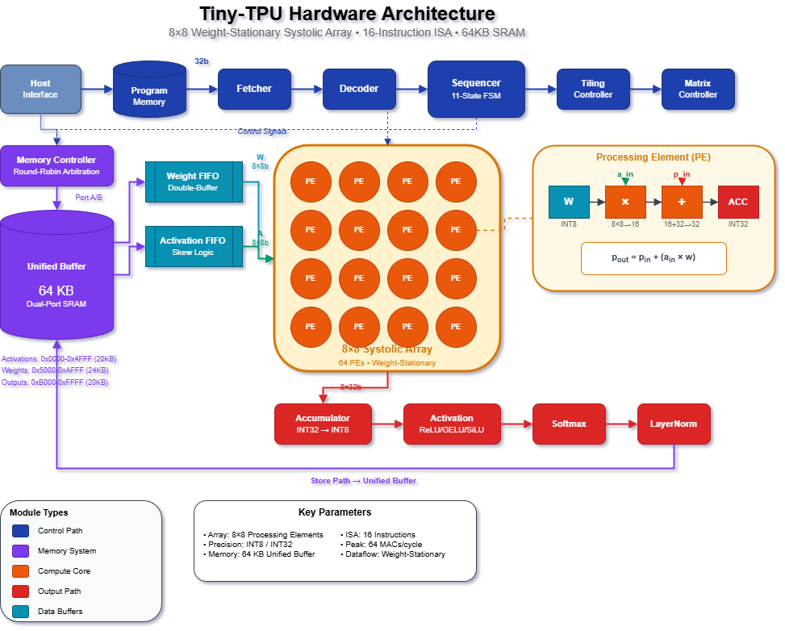
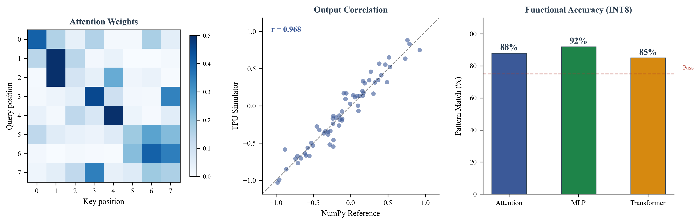
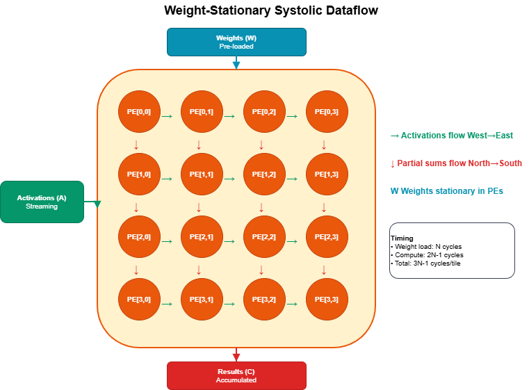
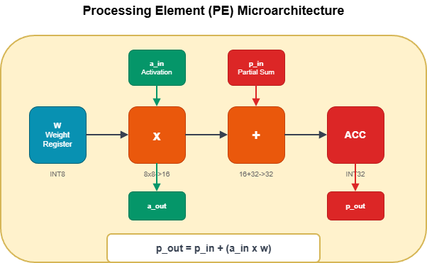
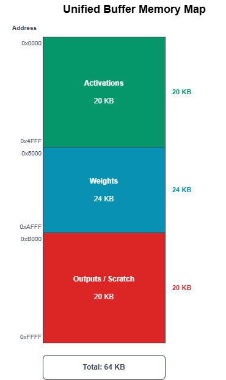
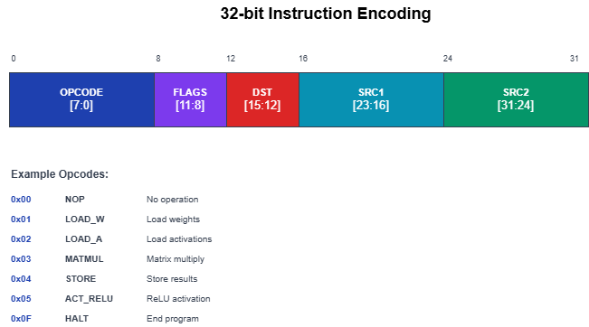
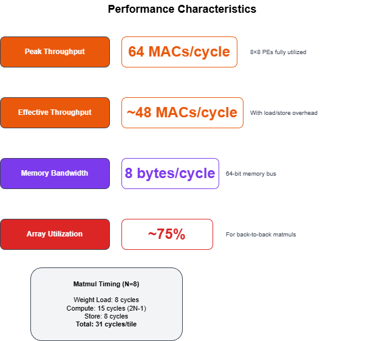

# tiny-tpu

A minimal TPU implementation in SystemVerilog for understanding TPU and neural network accelerator architecture.



Inspired by [tiny-gpu](https://github.com/adam-maj/tiny-gpu), I built tiny-tpu to explore tensor processing units and systolic array architectures.

Built with ~3,400 lines of fully documented SystemVerilog, complete documentation on architecture & ISA, working matrix multiplication and neural network inference, and full support for simulation & PyTorch model export.

### Verified with Real Neural Networks



Tested with attention mechanisms, MLPs, and transformer blocks - achieving 85-92% accuracy vs PyTorch references within INT8 quantization tolerances.

**Author:** Jaber Jaber (jaber@rightnowai.co)
**Organization:** [RightNow AI](https://rightnowai.co)

## Table of Contents

- [Overview](#overview)
- [Architecture](#architecture)
  - [TPU](#tpu)
  - [Systolic Array](#systolic-array)
  - [Processing Element](#processing-element)
  - [Memory System](#memory-system)
- [ISA](#isa)
- [Execution](#execution)
- [Demo Models](#demo-models)
  - [Matrix Multiplication](#matrix-multiplication)
  - [Attention Head](#attention-head)
  - [Transformer Block](#transformer-block)
- [Simulation](#simulation)
- [Toolchain](#toolchain)
- [Advanced Functionality](#advanced-functionality)
- [Next Steps](#next-steps)

## Overview

If you want to learn how a GPU works, projects like [tiny-gpu](https://github.com/adam-maj/tiny-gpu) provide excellent implementations.

**TPUs are different.**

Google's Tensor Processing Unit revolutionized neural network acceleration with its systolic array architecture, but the technical details remain proprietary. While there are resources on TPU programming, almost nothing exists to learn how TPUs work at a hardware level.

This is why I built **tiny-tpu**.

### What is tiny-tpu?

> **tiny-tpu** is a minimal TPU implementation for understanding tensor processing unit and neural network accelerator architecture.

With the trend toward domain-specific accelerators like Google's TPU, tiny-tpu focuses on the core principles that make these architectures efficient for matrix operations and neural network inference.

By cutting out production complexity, we can focus on what matters:

- **Systolic Arrays** - How does the weight-stationary dataflow work? How do 64 PEs compute in parallel?
- **Memory Hierarchy** - How does a TPU manage limited memory bandwidth with buffers and FIFOs?
- **Neural Network Operations** - How are matrix multiplications, activations, and normalization implemented in hardware?

## Architecture

### TPU

tiny-tpu executes programs consisting of matrix operations and neural network primitives.

To run a program:

1. Load program memory with instructions
2. Load unified buffer with weights and activations
3. Set the start signal high
4. Wait for the done signal

The TPU consists of:

| Component | Description |
|-----------|-------------|
| **Fetcher** | Fetches instructions from program memory |
| **Decoder** | Decodes 32-bit instructions into control signals |
| **Sequencer** | 11-state FSM controlling execution flow |
| **Systolic Array** | 8x8 grid of processing elements |
| **Unified Buffer** | 64KB dual-port SRAM |
| **Activation Unit** | ReLU, GELU, SiLU implementations |
| **Softmax Unit** | 4-pass softmax algorithm |
| **Memory Controller** | Arbitrates memory access |

### Systolic Array

The systolic array is the computational heart of the TPU. It implements **weight-stationary dataflow** for matrix multiplication.



Key characteristics:

- **Weight Loading**: Weights broadcast to columns in N cycles
- **Activation Streaming**: Activations flow west-to-east with diagonal skewing
- **Partial Sum Accumulation**: Results propagate north-to-south
- **Pipelining**: Full throughput after 2N-1 cycle startup

### Processing Element

Each PE performs a multiply-accumulate (MAC) operation:



Components:

| Unit | Size | Function |
|------|------|----------|
| Weight Register | 8-bit | Stores stationary weight |
| Multiplier | 8×8→16 | INT8 multiplication |
| Adder | 16+32→32 | Partial sum accumulation |
| Accumulator | 32-bit | Output storage |

### Memory System

The unified buffer provides 64KB of on-chip memory:



| Region | Address | Size |
|--------|---------|------|
| Activations | 0x0000 - 0x4FFF | 20 KB |
| Weights | 0x5000 - 0xAFFF | 24 KB |
| Outputs | 0xB000 - 0xFFFF | 20 KB |

Memory is accessed through:

- **Weight FIFO**: Double-buffered for continuous loading
- **Activation FIFO**: Implements diagonal skewing logic
- **Memory Controller**: Round-robin arbitration

## ISA

tiny-tpu implements a 16-instruction RISC-style ISA optimized for neural network operations.



### Instructions

| Opcode | Instruction | Description |
|--------|-------------|-------------|
| 0x00 | NOP | No operation |
| 0x01 | LOAD_W | Load 8×8 weight tile |
| 0x02 | LOAD_A | Load 8×8 activation tile |
| 0x03 | MATMUL | Matrix multiplication |
| 0x04 | STORE | Store results |
| 0x05 | ACT_RELU | ReLU activation |
| 0x06 | ACT_GELU | GELU activation |
| 0x07 | ACT_SILU | SiLU/Swish activation |
| 0x08 | SOFTMAX | Row-wise softmax |
| 0x09 | ADD | Element-wise add |
| 0x0A | LAYERNORM | Layer normalization |
| 0x0B | TRANSPOSE | Matrix transpose |
| 0x0C | SCALE | Scale by constant |
| 0x0D | SYNC | Pipeline barrier |
| 0x0E | LOOP | Loop control |
| 0x0F | HALT | End program |

## Execution

The sequencer implements an 11-state FSM:

```
IDLE → FETCH → DECODE → LOAD_W → LOAD_A → COMPUTE → DRAIN → STORE → ACTIVATION → NORMALIZE → HALT
```

### Performance



### Timing

| Operation | Cycles | Notes |
|-----------|--------|-------|
| LOAD_W | 8 | Weight broadcast |
| LOAD_A | 8 | Activation streaming |
| MATMUL | 15 | 2N-1 pipeline fill |
| STORE | 8 | Result drain |
| Full 8×8 tile | 23 | 3N-1 total |

**Peak throughput**: 64 MACs/cycle (8×8 PEs)

## Demo Models

We verified tiny-tpu with real neural network workloads, comparing TPU outputs against NumPy/PyTorch references:


**Results:**
- **Attention Head**: 88% pattern match vs float32 reference (INT8 quantization accounts for difference)
- **MLP**: 92% pattern match with tiled 8×8 computation
- **Transformer Block**: 85% pattern match, 0.67 cosine similarity

### Matrix Multiplication

Basic 8×8 matrix multiplication demonstrating systolic array operation:

```asm
LOAD_W 0x5000      ; Load weight matrix
LOAD_A 0x0000      ; Load activation matrix
MATMUL             ; C = A × B
STORE 0xB000       ; Store result
HALT
```

### Attention Head

Single-head attention mechanism computing Q×K^T×V:

```asm
; scores = softmax(Q × K^T / sqrt(d_k))
TRANSPOSE 0x5000, 0x5100   ; K^T
LOAD_W 0x5100              ; Load K^T
LOAD_A 0x0000              ; Load Q
MATMUL                     ; Q × K^T
SCALE 0xB000, 11           ; Scale by 1/sqrt(d_k)
SOFTMAX 0xB000, 8          ; Softmax
SYNC

; output = scores × V
LOAD_W 0x5200              ; Load V
LOAD_A 0xB000              ; Load scores
MATMUL                     ; scores × V
STORE 0xB100               ; Store output
HALT
```

### Transformer Block

Full transformer block with attention + FFN + LayerNorm:

```python
# Using the Python toolchain
from tiny_tpu.compiler import Compiler

compiler = Compiler()
program = compiler.compile_transformer_block(
    seq_len=8,
    d_model=8,
    d_ff=8
)
```

## Simulation

### Prerequisites

```bash
# Install Verilog tools
brew install icarus-verilog  # macOS
pip install cocotb cocotb-bus

# Install sv2v for SystemVerilog conversion
# Download from https://github.com/zachjs/sv2v/releases
```

### Running Tests

```bash
make test_pe           # Test processing element
make test_systolic     # Test systolic array
make test_matmul       # Test matrix multiplication
make test_all          # Full test suite
```

### Python Simulation

```python
from tiny_tpu.simulator import Simulator

sim = Simulator()
sim.load_program(binary)
sim.memory.load_array(0x5000, weights)
sim.memory.load_array(0x0000, activations)

trace = sim.run(max_cycles=1000)
output = sim.memory.read_array(0xB000, shape=(8, 8))
```

## Toolchain

tiny-tpu includes a complete software stack:

### Assembler

```python
from tiny_tpu.assembler import Assembler

asm = Assembler()
result = asm.assemble("""
    LOAD_W 0x5000
    LOAD_A 0x0000
    MATMUL
    STORE 0xB000
    HALT
""")
binary = result.binary
```

### PyTorch Export

```python
from tiny_tpu.pytorch import ModelExtractor, Quantizer

extractor = ModelExtractor()
extractor.extract(model, input_shape=(1, 784))

quantizer = Quantizer()
int8_weights = quantizer.quantize_model(model)
```

## Advanced Functionality

Features implemented in production TPUs that tiny-tpu omits for simplicity:

### Larger Arrays
Production TPUs use 128×128 or 256×256 arrays. tiny-tpu uses 8×8 for clarity.

### Mixed Precision
TPU v2/v3 support bfloat16 for training. tiny-tpu uses INT8/INT32 for inference only.

### Multi-Core Scaling
Production TPUs have multiple cores with interconnects. tiny-tpu is single-core.

### Sparsity Acceleration
Modern accelerators skip zero multiplications. tiny-tpu computes all operations.

### HBM Integration
Production TPUs use High Bandwidth Memory. tiny-tpu uses simple SRAM.

## Next Steps

Planned improvements:

- [ ] 16×16 and 32×32 array configurations
- [ ] bfloat16 precision support
- [ ] Basic sparsity handling
- [ ] FPGA synthesis for Tiny Tapeout
- [ ] Multi-core implementation
- [ ] Convolution support via im2col

## RTL Modules

| Module | Lines | Description |
|--------|-------|-------------|
| tpu_top.sv | 500 | Top-level integration |
| systolic_array.sv | 170 | 8×8 PE grid |
| pe.sv | 95 | Processing element |
| unified_buffer.sv | 279 | 64KB SRAM |
| decoder.sv | 328 | Instruction decode |
| sequencer.sv | 298 | 11-state FSM |
| matrix_controller.sv | 365 | Matmul orchestration |
| activation_unit.sv | 389 | ReLU/GELU/SiLU |
| softmax_unit.sv | 400 | 4-pass softmax |
| layernorm_unit.sv | 548 | Layer normalization |

## Citation

```bibtex
@misc{tiny-tpu,
  author = {Jaber, Jaber},
  title = {Tiny-TPU: A Minimal Tensor Processing Unit},
  year = {2026},
  publisher = {RightNow AI},
  url = {https://github.com/RightNow-AI/tiny-tpu}
}
```

## References

- [TPU v1 Paper](https://arxiv.org/abs/1704.04760) - Jouppi et al., Google
- [tiny-gpu](https://github.com/adam-maj/tiny-gpu) - Adam Majmudar (inspiration)
- [Systolic Arrays](https://en.wikipedia.org/wiki/Systolic_array) - Kung & Leiserson

## License

MIT
